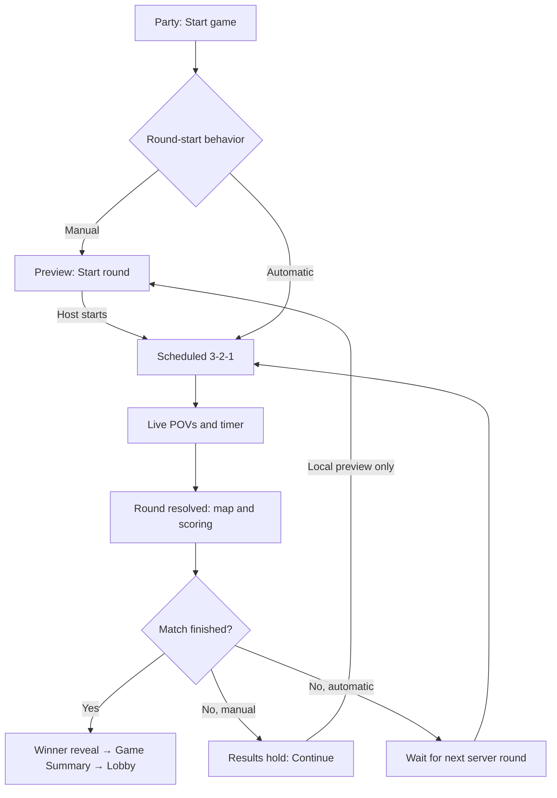

# Game-master presentation flow: implementation handoff

This describes the GeoGuessr party Duels game-master screen, including its local presentation state, HTTP controls and server-driven round transitions. It is intended to fill the gaps between live play, scoring, waiting and the next round in the custom presenter. Preserve the presenter's own branding; use these states and interactions as the behavioral reference.

The key distinction is **manual results → Continue → next-round preview → Start round → countdown → live play**. Continue changes the host's local presentation only. It does not start a round on the server. Auto-start skips the host's Continue/Start round interaction and transitions from results into the scheduled countdown.

## Visual references

Fresh captures from client `web-1.7711-e06e090`, using the two isolated guest test players:

| Capture | What it demonstrates |
| --- | --- |
| [Initial manual preview](samples/game-master-flow/manual-first-preview.jpg) | Round 01, mode and 60s setting in the HUD; full-width starting panorama; small map at bottom right; Start round + Space prompt |
| [Live round](samples/game-master-flow/manual-start-transition.jpg) | The transition capture landed after countdown, in live play; do not use this image as a countdown reference |
| [Manual results hold](samples/game-master-flow/manual-results.jpg) | Result map and settled score treatment remain visible with Continue; this particular round had no guesses and zero damage |
| [Next manual preview](samples/game-master-flow/manual-next-preview.jpg) | Round 02 starting panorama, mode/time HUD and Start round; server still on round 1 |
| [Scoring in progress](samples/scoring-animation/geoguessr-023.jpg) | Nonzero damage/multiplier choreography from the earlier auto-start comparison |

Adjacent JSON snapshots record server round, local preview round, view state, timestamps and HP. The manual test was left at round-2 preview for inspection. The lobby auto-start preference was restored to true after the test; the current test game's options remain `ManuallyStartAllRounds`.

## Two state clocks and two round numbers

Keep these separate in the implementation:

- **Server state:** game ID, version, status, current round number, start/deadline timestamps, guesses, round results, HP and final result.
- **Local presentation:** which round is being previewed, whether the outgoing scene is animating away, scoring progress and whether the host is showing the final summary.

In the confirmed manual test, clicking Continue changed `clientCurrentRoundNumber` from 1 to 2 and `viewState` from RoundScore to PreviewRound. `game.currentRoundNumber` stayed **1**, status stayed Ongoing, and round 2 still had no start time. The next panorama was already available in the privileged game-master snapshot. A spectator/ordinary-player snapshot may not contain those future rounds.

Do not infer current round from `rounds.length`: game-master state can contain many pre-generated panoramas. Do not interpret a local preview as a server round advance, clear authoritative history, or reset HP when the host presses Continue.

## Full manual-start flow

| Step | Game-master appearance | State / action that advances it |
| --- | --- | --- |
| 1. Party lobby | Player slots, map/movement settings, Start game | Host starts a game through the party endpoint |
| 2. Initial preview | Player cards at left/right, HP bars, round tally, mode/round/time HUD; one full-width panorama, small map, Start round and Space hint | Game Created, round 1 present but unstarted. Hold indefinitely until host starts |
| 3. Starting transition | Start button becomes loading/disabled; preview exits; “Starting round...” may appear while waiting for a scheduled start | Start-round click runs exit animation and sends the game-server command |
| 4. Pre-round countdown | Large 3, 2, 1 numerals; persistent player/HP framing; upcoming round rather than a running guess timer | Server announces future `startTime`; tick according to that timestamp |
| 5. Live round | Two player POVs in the large lower area, their guess maps and lock-in treatments; HUD shows live time when a deadline exists | `startTime` reached, game Ongoing, no completed result for the round |
| 6. First lock-in / final seconds | Lock-in banner/tint on the relevant POV; other player continues; timer follows the new shortened deadline; urgency styling and countdown audio | Guess state updates. A tentative pin is not a submitted guess |
| 7. Round resolution / scoring | POV scene leaves; lower panel becomes the result map with guesses, correct-location marker and connecting lines. Upper central HUD becomes scores/calculation; portraits and HP remain | Server round result arrives; animate from the saved pre-result HP to authoritative post-result HP |
| 8. Results hold | Settled result map, ghost/original scores, updated HP, completed-round tally, Continue at bottom center | No automatic expiry in manual mode. Host can remain here indefinitely |
| 9. Next preview | Continue replaces results with the next starting panorama; HUD returns to mode/round/time and displays the upcoming round; Start round appears again | **Local-only** preview advance. Server remains on the completed round |
| 10. Start next round | Same starting transition, 3–2–1 and live-play sequence as above | Start round sends the same command used for round 1; server advances to next round |

The results capture shows the tally already highlighting “2” while the server is still on completed round 1. This tally treatment is not evidence that the server has begun round 2. The next preview's large ROUND 02 panel is the explicit upcoming-round presentation.

**Host versus passive viewer:** the preview component checks `isHost`. The host sees the panorama and Start round control. A non-host in that preview state receives a waiting-for-game-master message, or countdown numerals once available. On manual results, the host sees Continue; a non-host gets waiting-for-game-master text. Do not put interactive game-master controls on a passive broadcast output.

## Auto-start flow

For a normal automatically started round, the result map/scoring stage is still shown. It has **no host Continue button**. The next `DuelNewRound` updates the authoritative round and supplies a future start time; the content changes to RoundAutoStarting, which renders the countdown overlay, then to the two live POVs when the start time arrives. It does not hold on a host-controlled panorama preview with a Start round button.

Earlier captures observed the next-round event roughly eight seconds after timeout, and start times roughly 2–4 seconds after their announcing event. These are observations, not constants to hardcode. Keep showing the last valid scene while awaiting server state and use the announced `startTime`. Do not locally call start-next-round just because the score animation finished in auto mode.

Use the **current game's** `options.roundStartingBehavior` for behavior:

| Value | Expected control pattern |
| --- | --- |
| Default | Automatic round starts |
| ManuallyStartAllRounds | Host preview/start for every round |
| ManuallyStartFirstRound | Manual first round, automatic later rounds; supported by source, not visually exercised in this session |

The source also suppresses its auto-start presentation predicate when `hasPaused` is true (including help/review state). Lobby preference `masterControlAutoStartRounds` configures games, but changing a lobby checkbox is not proof that an existing game's options changed.

## Commands, events and timing

| Action | Request | Expected follow-up |
| --- | --- | --- |
| Create/start party game | POST `/api/v4/parties/v2/start-game`, `{}` | 200 `{"message":"OK"}`; discover the new game/node through party state |
| Continue from manual round results | No game-state request in this handler | Increment local preview round only |
| Start previewed round | POST `https://gs2.geoguessr.com/<node>/<game>/game-master/start-next-round`, `{}` | 204 with no body; await authoritative started/new-round state |
| Abort match | POST `https://gs2.geoguessr.com/<node>/<game>/abort`, `{}` | 204; follow resulting state rather than inventing a normal winner |

The inspected Start round handler plays a click, waits 150 ms, begins preview exit, waits 750 ms, hides the preview, then waits 850 ms before setting the POV panoramas and issuing the request. Thus there is about **1.75 seconds of local staging before the HTTP command**, followed by the server countdown. Prevent duplicate submissions while it is pending. HTTP success alone must not start the client timer; a 204 contains no state, and the command is not known to be idempotent.

Round 1 may produce `DuelStarted` first with Created state and later with Ongoing state. Later starts use `DuelNewRound`. `DuelRoundTimedOut` includes resolved scores/HP. A deadline reaching zero does not itself prove that results are ready. Read the authoritative `endTime`; the first guess can replace a long deadline with `now + timeAfterGuess`. With no max time, the deadline can be absent before any guess.

Scene swaps use a **700 ms outgoing-scene delay** in the common presentation helper (blink mode overrides the main content delay). HUD mode/timer sub-transitions use an additional 450 ms helper. Treat these as presentation choreography, not network delays. The source animates the upper score/HP region and the lower result map as distinct components, so they need not finish simultaneously.

## Scoring and what remains on screen

The points count starts 1.21 seconds after mounting the damage component and lasts 750 ms. Then the winner's number collides with the loser, becomes the difference, receives the multiplier if applicable, and flies toward the losing health bar. HP damage begins around 4.81 seconds at x1 or 5.31 seconds with a multiplier. Ties collide and disappear without HP damage. Original/ghost scores persist; the lower map remains usable while waiting.

Do not reset to an empty “next round” panel immediately after the HP tween. In manual mode, preserve the results scene until Continue. In automatic mode, preserve it until the next server-driven scene transition. Do not replay score/HP animation for every incoming state version; identify the particular game's completed round, and reset that identity deliberately for a rollback.

Use [scoring-animation.md](scoring-animation.md) for detailed choreography, [sfx-timing.md](sfx-timing.md) for scoring cues, [round-sfx-timing.md](round-sfx-timing.md) for lock-in/countdowns and [music-scenes.md](music-scenes.md) for scene music. Music changes are state-driven; they are not all anchored to the score component's clock.

## Match finish, summary and interruptions

### Complete end-to-next-game loop

The interactive party game-master loop is:

**Final server result → winner reveal → Game Summary button → round-by-round summary → Continue → party lobby → Start game → new game ID → initial preview/countdown.**

Auto-start controls rounds **within a duel**. It does not automatically create the next duel, press Game Summary, or dismiss everyone's result screen.

| Stage | What appears / remains | Trigger and implementation detail |
| --- | --- | --- |
| Final resolution | Final authoritative HP/result is available; ordinary next-round controls are suppressed | Handle `DuelFinished` with `status: Finished` and `result`. Preserve the final game snapshot for winner and summary views |
| Winner entry | Central winner avatar begins appearing; normal central round HUD/HP region exits | GameFinished presentation state. Use `result.winningTeamId`, not a guessed winner from whichever HP animation finished first |
| Winner reveal, +900 ms | Winner name and muted winner video appear; EFFECT_WINNER_TEXT_REVEAL plays | Time measured from the winner component's mount callback. Avatar plays its WIN animation when visible |
| Winner settled, +2,400 ms | Game Summary becomes available in ordinary interactive party mode | 900 ms initial delay + 1,500 ms settling delay. This flag is timer-based, not the video's ended event |
| Winner hold | Winner presentation and Game Summary button stay available | No automatic summary navigation is implemented by this party winner component |
| Game Summary pressed | Winner presentation exits and the summary replaces it | Local `isShowingSummary = true`; approximately 1,100 ms transition helper. No new-round command |
| Summary hold | Game Summary heading, breakdown of played rounds and Continue | Retain final snapshot. This is review of the completed game, not a reset to round 1 |
| Continue pressed | Exit the active game view to the party/lobby | Uses the supplied party `exitGame` callback, or a party-page link when no callback exists; does not start a new match |
| Lobby ready | Party membership/player slots and chosen settings are available for another match | Keep party identity separate from the finished duel identity |
| Host presses Start game again | A fresh duel is created using current party settings | Discover the new game/node; initialize presentation for that new game. Manual settings lead to first preview; automatic settings lead to scheduled countdown |

The winner video is `/_next/static/video/winner-08d6458d11f01196..webm`, rendered muted and autoplaying; the separate reveal sound provides audio. Do not assume a video audio track supplies the sting. In 1v1 the winner label is the winning player's name; team Duels uses Team Blue/Team Red. Source: [winner-sequence-source.json](samples/game-master-flow/winner-sequence-source.json) and [finished-source.json](samples/game-master-flow/finished-source.json).

**Player screens are independent.** The test guests saw their own Victory/Defeat presentation, Continue and Game Breakdown. They remained on the old finished game's screen when the host created the next duel. Clicking Continue returned each to the lobby, where Rejoin game entered the new active duel. The test-guess loops only resume after that new duel is mounted. A host returning to the lobby does not prove all players returned, and creating a new game does not prove every tab navigated into it.

**Standalone broadcast output is a separate contract.** The earlier `/party/broadcast/<partyId>` capture documented a six-second finished-result hold followed by idle while waiting for a new lobby/game ID. That behavior belongs to that outer broadcast wrapper and older captured client, not the interactive party game-master winner component above. For the custom presenter, expose an explicit output policy: operator-controlled winner/summary/hold when emulating game master, or a configured finished hold followed by idle for unattended broadcast. Do not accidentally apply the six-second timeout to the host's interactive summary. This policy choice is an implementation recommendation; it is not a newly observed GeoGuessr setting.

**State cleanup for another duel:** retain old results while their winner/summary is on screen. When a new game is selected, replace game/node identifiers and reset local preview index, score-animation deduplication, pending start command, countdown scheduling, guess/lock-in flags and summary visibility. Clear old scene timers/listeners so they cannot switch the new game back to an old result. Initialize HP from the new game snapshot. Preserve party settings, player identities and the requested map-rendering preference. These are implementer requirements inferred from the observed lifecycle, not additional server commands.

**Do not turn an abort into a normal victory.** Captured `DuelAborted` can also have Finished status and a winner-shaped result. Retain the event reason and present cancellation/idle as appropriate instead of awarding a normal match win solely from `status`. A draw or missing winner also needs a neutral result treatment; the exact game-master draw-at-match-end animation has not been verified. The observed tie animation elsewhere in this document is a tied **round**, not necessarily a drawn match.

### Verification scope and interruptions

When finished state and a result are available, the game-master has a separate **GameFinished** scene. The ordinary central HUD/HP content exits and a winner presentation uses `result.winningTeamId`. In party mode, **Game Summary** appears after the winner animation settles. Pressing it changes local summary state, with an approximately 1,100 ms transition helper; the summary contains the per-round breakdown and a **Continue** action back out of the game. It must not open another panorama preview after a knockout or round limit.

The live automatic bot match reached the winner screen with Presenter Bot Blue and Game Summary. The exact knockout-frame ordering relative to the final scoring animation was not frame-captured; do not claim a fixed final-score hold or an identical ordinary-round timing from this evidence. The source's non-final result panel hides Continue when either team has zero HP or the maximum round count has been reached. External tournament outros may replace the party winner flow.

For pause/review, the content can carry **“Game is under review”** while `isPaused` is true and status is not Finished. A pause request is not necessarily an immediate freeze: earlier probes showed pause taking effect at the deadline before normal result processing. Rollback can emit DuelNewRound, reset later results/HP and replay the same panorama; it is not necessarily a dedicated rollback event. See [presenter-protocol.md](presenter-protocol.md) for the confirmed controls and limits.

On reconnect, reconstruct the appropriate static scene from the snapshot. Local preview selection is not server state: reopening a manual game between rounds may return to completed-round results. Avoid using stale game/node identifiers when starting a new match. Distinguish no guess (`bestGuess: null`) from a genuine zero-point guess.

## Implementer acceptance checks

- Manual initial creation stays on preview without a running timer.
- Manual results stay visible indefinitely; Continue opens preview without issuing start-next-round.
- Start round sends exactly one command, shows pending state, then follows the server countdown.
- Server and preview round numbers can differ by one without corrupting history, HP or upcoming panorama selection.
- Automatic rounds display scoring/results, omit Continue/Start controls, then use the next server start time.
- Lock-in shortens the displayed deadline, and a timer at zero waits for actual resolution.
- Ties, no-pin timeouts, multiplier damage and knockout all lead to the correct next scene.
- Finished games show winner → summary → exit, never an unstarted next panorama.
- Game Summary appears only after winner settling; opening it and leaving it do not send start-next-round.
- Auto-start does not create another duel; the host explicitly starts a new match with a new game ID.
- Guest/player tabs can still show the old result after the host starts another game; their navigation is tracked separately.
- A new game clears old scene timers/summary/animation state while preserving party configuration.
- Abort and drawn-match handling do not fabricate a normal winner from Finished status alone.
- Scene audio does not restart on every state update. Countdown effects remain on the effects volume channel.
- Use the requested **RASTER roadmap** configuration, documented in [map-style.md](map-style.md).

## Evidence and scope

Fresh manual visual/state evidence is in [samples/game-master-flow/](samples/game-master-flow/). Exact state predicates and preview/result handlers are in [game-master-state-source.json](samples/scoring-animation/game-master-state-source.json) and [game-master-flow-source.json](samples/scoring-animation/game-master-flow-source.json). Scene mounting and final-screen source excerpts sit beside the fresh screenshots. Automatic scoring/round-transition captures are in [samples/scoring-animation/](samples/scoring-animation/). This handoff changes documentation only; no presenter implementation was edited.
