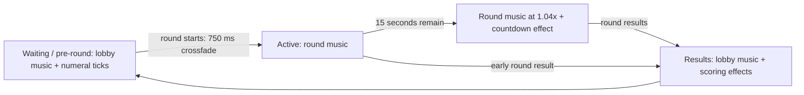

# Duels music by scene

Source inspection of GeoGuessr `web-1.7711-e06e090`, 2026-09-11. The party game-master wrapper installs the shared Duels audio lifecycle. The following is its programmed behavior; this pass did not advance the game or record a fresh audible transition.

## Scene selection and layering

| Scene | Music bed | Additional audio / change |
| --- | --- | --- |
| Created game, waiting, or pre-round countdown before `startTime` | MUSIC_DUELS_LOBBY | Preview/door effects and separate ticks for 3, 2, 1, depending on the mounted view |
| Active round | Selected round track, looping | Panorama reveal and later guess/lock-in effects |
| Last 15 seconds of the round | Same selected round track | Music playback rate changes to **1.04**; EFFECT_TIMER_COUNTDOWN fades in over **200 ms** on top |
| Current-round results exist for both teams while game remains Ongoing | MUSIC_DUELS_LOBBY | Crossfade from the round track; countdown fades out over **1,000 ms**; round track rate restored to **1.0**; scoring effects run separately |
| Waiting for another manually started round | Lobby music normally continues from the results scene | No restart merely because the same music is requested again |

There are two different countdowns. The pre-round countdown has the lobby bed plus short numeral ticks. The final in-round countdown keeps the round bed and adds an 18-second effect clip aligned to the final 15-second window. The different sound during that window therefore does not require switching to a separate countdown music track.

## Which active-round track?

Selection is evaluated in this order:

1. Healing round: MUSIC_HEALING_ROUND (same MP3 as MUSIC_ROUND_ONE).
2. Otherwise, `round.multiplier > 1`: MUSIC_ROUND_FOUR, regardless of round number.
3. Otherwise, round 1, 2 or 3 selects its corresponding track; later rounds select FOUR.

| Key | Source filename under `https://www.geoguessr.com/_next/static/audio/` |
| --- | --- |
| MUSIC_DUELS_LOBBY | new-music-lobby-8a0cf0fa0d4bd650..mp3 |
| MUSIC_ROUND_ONE / MUSIC_HEALING_ROUND | new-music-round-1-f780550e091a7285..mp3 |
| MUSIC_ROUND_TWO | new-music-round-2-7c3efa8317e6b19d..mp3 |
| MUSIC_ROUND_THREE | new-music-round-3-b0358e003eb4c963..mp3 |
| MUSIC_ROUND_FOUR | new-music-round-4-1d779860f57d4dd7..mp3 |

All six keys declare looping. Music was excluded from the earlier SFX download; these are source references, not local downloaded music files.

## Crossfades, seeking and restart behavior

The sound manager maintains one selected music channel. Selecting a different music track starts a **750 ms fade-out** on the previous track and a **750 ms fade-in** on the new one concurrently; the outgoing track stops after its fade. With no previous music channel, fade-in is **250 ms**. Thus two music tracks overlap briefly during transitions, but this code does not manage persistent synchronized musical stems.

Requesting the same track while it is playing does nothing. If it is selected but stopped, the manager fades it in over 250 ms. When entering results, the lifecycle records a lobby seek position of **6 seconds**; otherwise it records 0. It applies this seek only if the lobby track is not already playing. This means post-round playback uses a different portion of the same lobby asset from initial waiting, and does not always replay its opening.

The final-countdown effect seeks into its clip when arriving late: at 8 seconds remaining it seeks to 7 seconds. Changing the deadline recalculates the schedule. The active music's 1.04 rate is an actual Howler playback-rate change, not a gain or alternate-track selection. At results, the countdown fade-out and music crossfade can overlap the first scoring/transition sounds.

## Volume controls and lifecycle details

- Music tracks use `musicVolume`; countdown, ticks, lock-in and scoring effects use `effectVolume`. Setting music volume to zero can therefore leave countdown audio audible.
- Gain is the relevant volume setting multiplied by each asset's `volumeMultiplier`, clamped to 0–1. The pre-round tick multiplier is 1.3. Master or temporary mute makes both effective volume settings zero.
- No music ducking call was found in the countdown/guess/scoring lifecycle. Effects overlap the bed; the countdown changes music speed, while scene transitions change tracks.
- The shared hook does not select music from the presenter visual-stage enum. It derives the choice from game status, current-round start time, lobby status and round results. Audio transitions need not coincide exactly with score-component mounting.
- `handsOverMusic` affects cleanup: without it, leaving the hook fades out a playing lobby track; with it, that cleanup fade is skipped so the outer view can retain the bed. It does not disable the normal scene-selection logic.
- A finished match blocks starting another active-round track. The hook's post-round-results test requires game status Ongoing; final-match outros have their own behavior. Do not assume every final match is handled identically to an ordinary round end.
- There is no explicit `isPaused` branch in this music hook. Pause behavior depends on the remaining game-state predicates; a dedicated pause-music rule has not been verified.

## Evidence

[music-source.json](samples/scoring-animation/music-source.json) contains the complete Duels registry/lifecycle module and the Howler wrapper/music manager. [music-context-source.json](samples/scoring-animation/music-context-source.json) records volume controls, outer-view lobby calls and music handoff sites. [round-sfx-hook-source.json](samples/scoring-animation/round-sfx-hook-source.json) confirms the game-master wrapper uses this lifecycle. [round-sfx-timing.md](round-sfx-timing.md) provides effect timings and the unresolved end-of-round audible-cue distinction.
