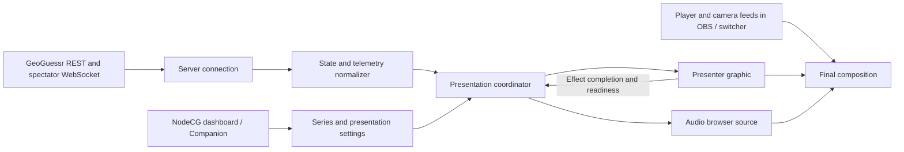

# Custom GeoGuessr presenter design

Date: 2026-09-11

Status: Design for review; implementation has not started.

## Purpose and scope

Build a custom HTML presenter for RASHINBAN 2026 inside the existing NodeCG
bundle. It replaces the broadcast presentation while GeoGuessr remains the
authority for gameplay. The operator continues to start rounds and perform
all game-control actions in GeoGuessr's UI.

Scope is 1v1 Duels in MOVE, NM, and NMPZ, with no healing rounds. The presenter
includes live views, round results, health, timers, BO3 series scores, keyed
player-camera windows, custom music, sound effects, and single/double-5K videos.
Avatars, chat/emotes, TeamDuels, other game types, and remote game control are
outside this version.

This design builds on:

- [NodeCG stack design](../../plans/2026-09-10-nodecg-stack-design.md).
- [Capture-first design](../../plans/2026-09-10-geoguessr-capture-design.md).
- [Captured presenter protocol](../../geoguessr/presenter-protocol.md).

Protocol behavior below comes from the repository's 2026-09-10 captures, not
a claim of a stable public API. Live verification is part of implementation.

## Agreed decisions

| Area | Decision |
| --- | --- |
| Connection | NodeCG connects directly with a supplied GeoGuessr session cookie. No forwarding userscript is required. |
| Game control | Remains in GeoGuessr's UI. NodeCG controls presentation only. |
| View source | One global rendered/chroma-key setting applies to both players. |
| External player feeds | Replace the entire player view, including Street View and the guess map. |
| Rendered NMPZ | One shared fixed panorama and two independent player maps. |
| Chroma-key NMPZ | Two full player-feed windows, like the other modes. |
| Cameras | Two keyed camera windows, visible during live play and round results. |
| Key color | Configurable green or magenta. |
| BO3 score | Shown on the graphic; NodeCG owns the initial editable data source. |
| Music | User-supplied synchronized stems, layered by context. No browser pitch or tempo changes. |
| Audio output | Separate persistent audio browser source, with an embedded fallback if OBS synchronization is inadequate. |
| 5K timing | At round results, never immediately on guess submission. |
| 5K variants | Separate single-5K and double-5K video assets. One celebration per round. |
| 5K sequence | Full-screen effect covers the transition; score counting and damage animations/sounds begin after it finishes. |

The remaining details in this document are proposed implementation defaults,
including manual series-score entry, fixed live-window geometry, and recovery
behavior. They make the design implementable without deciding final branding
or requiring the media assets now.

## Architecture and alternatives

Use the existing TypeScript, vanilla HTML/CSS, esbuild, NodeCG Replicant, and
Companion HTTP patterns. Add a presenter graphic, an audio-only graphic, and
a presenter dashboard panel to the existing bundle.

The direct connection is chosen over a userscript forwarder because it removes
browser installation and forwarding configuration. Rewriting GeoGuessr's page
in place was also considered in the capture research; keeping presentation in
the existing NodeCG bundle gives it its own layout and media lifecycle.

The connection, normalizer, presentation coordinator, renderers, and audio
engine have separate responsibilities. The normalizer can consume recorded
fixtures without opening a live connection. Renderers do not interpret raw
GeoGuessr messages or hold authentication credentials.

## Connection and authoritative state

Store the supplied cookie in local server configuration, outside committed
files. Never publish it in Replicants, browser payloads, diagnostics, or logs.
Support an explicit party ID, with active-party discovery as a convenience.

Following the captured protocol, the extension polls party state, resolves
the lobby's game-server node, obtains a spectator snapshot, and opens the
spectator WebSocket. It subscribes to lobby state and live-stream telemetry,
sends heartbeats, and follows new lobby IDs between games.

Within a game, accept only newer full-state versions; reset that comparison
when the game ID changes. Snapshot replacement handles state recovery, while
derived events require comparison with the prior accepted state. A
`DuelStarted` received on reconnect is not inherently a new game or round.
Telemetry is tracked separately per player and sample timestamp, and reset
at game/round boundaries so old movement or map bounds cannot leak forward.

Treat `DuelAborted` distinctly from a genuine finish even though both may
carry `status: Finished` and a winner. Neither automatically changes the BO3
score in this version. Handle normal session closure by returning to party
discovery; reconnect transient failures with bounded backoff. Authentication
failure requires an operator-visible status and a cookie update, not endless
rapid retries.

Round timing follows server timestamps and the current round's `endTime`.
Use server-clock offset information where available. A future `startTime`
means pre-round countdown; a null start time in `Created` means waiting for
the host. Do not run a timer merely because a snapshot was received.

## Shared data boundaries

Define shared TypeScript types under the bundle's existing `src/types` tree.
Use the following conceptual Replicant boundaries; exact field names can be
finalized in the implementation plan:

| State | Responsibility |
| --- | --- |
| Connection status | Party/game identity, connection state, last update, sanitized errors. |
| Duel state | Accepted game/version, mode, rounds, players, health, pins, guesses, results, deadlines. |
| Player views | Latest per-player panorama, POV, zoom, map visibility, bounds, and pin telemetry. |
| Series state | Stable competitors, GeoGuessr player-ID mapping, display names/handles, BO3 wins, broadcast left/right assignment. |
| Presenter settings | Global view source, key color, audio output mode, media configuration, gains, and transition durations. |
| Presentation timeline | Current phase, game/round identity, sequence generation, scheduled stages, cue identities, and music epoch/context. |

Keep raw and normalized game state separate from the visible presentation.
Scores and panorama answers may arrive before the reveal, but result labels,
answer markers, damage, and 5K effects remain hidden until the results phase.
The results sequence retains health-before/health-after values so an incoming
snapshot cannot prematurely snap the on-screen health bar to its final value.

Series state is independent of duel health, team colors, and lobby lifetime.
The operator sets names, side mapping, and wins in NodeCG. Preserve wins across
new games and restarts; resetting a series is explicit. Validate BO3 wins as
integers from 0 to 2. A future Sheets or start.gg adapter writes through this
same series interface, with an explicitly selected source to avoid competing
writers. Those integrations are not implemented now.

## Visual composition

Target a 1920 x 1080 OBS browser source. Use the supplied RASHINBAN 2025
screenshots for the initial composition: a top scoreboard, health bars near
the gameplay region, blue/red player identification, and cameras below.
Final fonts, artwork, exact dimensions, and sponsor treatments are styling
work rather than protocol requirements. No avatar containers are reserved.

The scoreboard shows player names/handles, BO3 wins, round number, movement
mode, and applicable damage multiplier information. Health and lock-in state
remain distinct from series scores. Support separate player multipliers when
the authoritative state differs between sides.

| Mode/source | Main live content |
| --- | --- |
| Rendered MOVE | Two player panels; independent panorama position/POV/zoom and player map telemetry. |
| Rendered NM | Two player panels; fixed round location with independent POV/zoom and player maps. |
| Rendered NMPZ | One larger shared panorama at the round's initial POV/zoom; two independent player maps. |
| Chroma-key, any mode | Two fixed full-player-feed rectangles. Each external feed supplies its own panorama and map. |

Rendered player maps follow captured map bounds, pins, and applicable
visibility telemetry. In the shared NMPZ layout both map slots stay present;
an inactive map can be visually subdued without changing geometry. Rendered
views are spectator displays with local navigation disabled. Initial round
data supplies the view until fresh telemetry arrives.

Use a renderer adapter for Google Maps/Street View. The captured protocol
supplies panorama identifiers and view data, but credentials, panorama-ID
compatibility, POV/zoom mapping, loading behavior, and OBS performance must
be verified before claiming renderer fidelity. Do not assume GeoGuessr's
Google credentials can be reused. A loading/error state must preserve the
rest of the graphic and allow the operator to switch globally to keyed feeds.

Camera slots always contain solid key color; the HTML does not acquire camera
video. They remain in stable positions during live play and round results.
The results layout uses a central answer/guess map, player distances, scores,
and health changes while keeping both cameras and the top scoreboard visible.
This results layout is rendered by the presenter in both gameplay source modes.

OBS/switcher composition must crop each external feed to its assigned region.
Keying the HTML does not itself resize, move, hide, or mute those feeds. The
results background covers the former player-feed regions, and the 5K video
covers the whole composition including camera slots. Key filters must not
erase colors in rendered maps or effects: prefer region-scoped keying/crops,
and verify this with the actual green/magenta choice and media in OBS.

## Presentation phases and round results

The coordinator derives waiting-for-game, waiting-for-host, pre-round,
live-round, results-transition, results-reveal, between-rounds, game-finished,
and aborted presentation states. Urgency is a live-round context, beginning
at the first accepted guess or when the authoritative remaining time reaches
15 seconds. It does not expose the guess score.

On confirmed round resolution:

1. Freeze the result data for that game/round and enter results music context.
2. Count the players whose resolved round score is exactly 5000, including
   auto-submitted guesses. Zero selects no video, one selects single-5K,
   and two selects double-5K. Do not queue two single effects.
3. Play the selected full-screen video once, covering the change of layout.
4. When the active graphic reports completion, schedule the shared results
   reveal with a short lead time for both browser sources. Without a video,
   schedule the reveal directly.
5. Reveal map, distances, and score counting; play the counting cue for its
   animation interval. Then animate damage and health with their matching cue.
6. Hold the completed results until the next round or game presentation.

Key the sequence by game ID, round number, and a generation ID. A duplicate
snapshot, repeated completion callback, preview page, or late message cannot
start it again. Register one active program graphic as the completion source;
preview graphics cannot advance the program timeline.

A video load/play error or missing completion is bounded by a configured
watchdog and proceeds to results with an operator-visible warning. Missing
custom media never blocks the round. No-pin timeout results display N/A for
distance and zero score, distinguished from a real guess scoring zero.

GeoGuessr controls progression. If a newer round starts before a long effect
or reveal finishes, cancel the old sequence and pending cues and catch up to
the new authoritative phase. Do not hold stale results over live play. A
genuine finish waits for the final round's presentation to complete before
showing the game winner; an abort cancels pending celebration and shows an
aborted state. Proposed default: retain finished-game presentation until a
new lobby arrives rather than imposing GeoGuessr's six-second idle return.

## Audio engine and synchronization

Default to a separate persistent audio-only OBS browser source. Keep it active
across scene changes and disable source shutdown/refresh behavior that would
restart playback. The same engine can instead run in the presenter graphic
through a global output-mode setting. Only one source owns audible output;
previews and the inactive output path stay silent.

The user will supply authored MP3/WAV stems and sound-effect assets later.
A media manifest defines files, loop regions, common musical alignment, gains
per context, and fade durations. Preload/decode stems and start them on a
shared audio clock. Muted layers continue advancing, allowing phase-aligned
fades across live, urgent, and results/waiting mixes. The rhythm layer can
continue throughout. No playback-rate modulation, pitch shifting, time
stretching, or browser retuning is used.

Aligned loop regions and compatible authored lengths are asset requirements;
do not rely on MP3 container duration alone for seamless looping. Silence is
the initial fallback when assets are absent. Proposed idle behavior is to
fade music out after the finished-game presentation or abort, and start a new
musical session for the next game. Between rounds it remains continuous.

Separate effect cues include pin placement, guess submission, countdown ticks,
results reveal, score counting, and damage. Trigger pin sounds from accepted
pin changes, with duplicate suppression and a configurable rate limit; map
panning alone is silent. Derive guess cues once per player/round, not once
per transport message. Results cues follow the presentation timeline rather
than receipt of the raw result snapshot.

NodeCG publishes timestamped stages and cue IDs with a short scheduling lead.
Both browser sources estimate their offset to the NodeCG clock and schedule
against the same timeline; the audio source maps this to its audio clock.
Maintain a shared music epoch to restore loop position on reload. Do not
attempt to correct stem drift by changing playback speed.

The graphic reports 5K video completion; NodeCG then schedules visual and
audio result stages together. Define one owner for any 5K soundtrack: either
audio embedded in the video or a separate cue, never both. Embedded video
audio, if used, is the deliberate exception to the otherwise silent graphic.

On reconnect or late join, restore current mix and visual phase, skip expired
one-shot cues, and avoid replaying completed celebrations. A NodeCG process
restart establishes a fresh scheduling generation from the latest snapshot;
historical effects are not reconstructed as new events.

Separate browser sources are not assumed to be frame-perfect. Measure the
result in OBS; a proposed acceptance target is sound/visual cue alignment
within 50 ms without accumulating drift over a 30-minute session. If that
cannot be achieved reliably, use the agreed embedded-audio fallback and run
the same validation again.

## Operator controls and failure behavior

The dashboard provides connection/readiness status, party selection/reconnect,
series identity and score editing, side assignment, global view mode, key
color, media readiness, music/effect gains, mute, and audio output mode.
Expose useful presentation actions through the existing Companion endpoint
pattern. Isolate preview/test cues from live sequences.

On transient data loss, retain the last valid layout and report stale data
to the operator. A known countdown may reach zero, but the presenter must
wait for authoritative resolution rather than invent results. On reconnect,
replace state and resume the current phase without replaying history. A
new game/round invalidates callbacks and telemetry from previous generations.

Unknown protocol messages are logged in sanitized diagnostics and ignored
unless they invalidate known state. Unsupported game types show waiting/
unsupported status rather than attempting a duel layout. Pause and rollback
commands are not implemented; their presentation behavior needs additional
captures if they are used at the event. Never infer game-control permission
from access to the spectator socket.

## Validation and implementation boundaries

Use the recorded fixtures under `docs/geoguessr/samples/` to verify:

- Version replacement and reconnect snapshots without duplicate round starts.
- Created/manual-start waiting, future start times, maximum round deadlines,
  and first-guess urgency.
- Auto-submission, no-pin timeouts, health transitions, finish versus abort.
- Correct result gating and single/double-5K selection. Add a synthetic
  double-5K fixture if the recordings do not contain one.
- Deduplication, stale callbacks, media failure, late join, and cancellation
  when a new round overtakes a results sequence.
- Series wins surviving new lobbies without automatic increments.

Use replay-driven browser checks for every mode/source layout, both key
colors, camera persistence on results, and absence of early answer/score
reveals. Verify rendered map/panorama behavior against a live test party.
Finally verify actual OBS composition, media support, audio activation,
source lifecycle, synchronization, and recovery with the intended assets.

Implementation should proceed in reviewable stages: connection and fixture
normalization; presentation state and dashboard; keyed layouts and results;
rendered map/Street View adapter; synchronized audio and 5K sequencing; OBS
integration validation. All stages serve this design, but map access and
separate-source synchronization are explicit feasibility checks rather than
assumed successes.

Media files, final branding, Google rendering credentials, and live test-party
access are external inputs. Configuration and silent/missing-media fallbacks
allow implementation and replay validation before those assets arrive. The
next artifact after review is an implementation plan, not immediate code.
